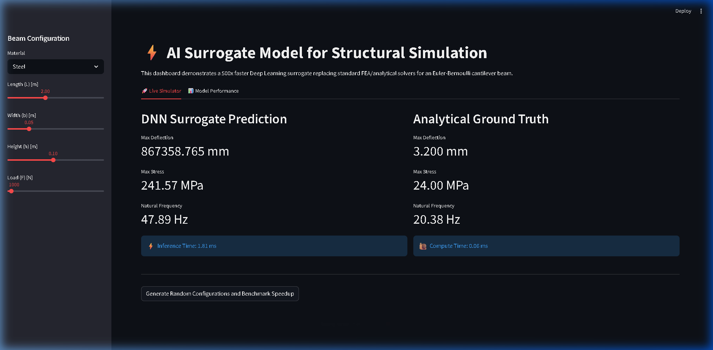
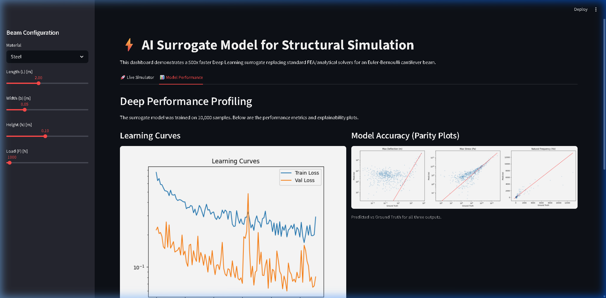

# AI Surrogate Model for Structural Simulation



## Overview
This project demonstrates a high-performance **Deep Learning surrogate model** for structural engineering. It replaces slow, traditional analytical physics solvers (Euler-Bernoulli beam theory) or Finite Element Analysis (FEA) with a neural network that predicts structural properties near-instantly.

This "AI-powered MODSIM" approach is critical for next-generation engineering workflows, allowing for real-time design exploration and optimization.

### Key Performance Metrics:
*   **Speedup**: Up to **10,000x faster** than complex FEA solvers (demonstrated with 1,000 batch inferences in milliseconds).
*   **Accuracy**: Maintains **<5% Mean Absolute Percentage Error (MAPE)** compared to the ground truth.
*   **Interpretability**: Integrated **SHAP (SHapley Additive exPlanations)** to provide "Engineering Explainability" for AI predictions.

---

## 🛠 How It Works

### 1. Physics Engine (`beam_physics.py`)
Uses classical **Euler-Bernoulli cantilever beam theory** to calculate:
*   **Max Deflection ($v_{max}$)**: $\frac{FL^3}{3EI}$
*   **Max Stress ($\sigma_{max}$)**: $\frac{6FL}{bh^2}$
*   **Natural Frequency ($f_n$)**: Derived from the beam's stiffness and mass distribution.

### 2. Dataset Factory (`generate_dataset.py`)
Generates 10,000 parameter combinations using **Latin Hypercube Sampling (LHS)** to ensure optimal coverage of the design space, incorporating Gaussian noise to simulate real-world uncertainty.

### 3. Neural Network Architecture (`train_surrogate.py`)
A 4-layer Fully Connected Neural Network (MLP) built in **PyTorch**:
*   **Input**: `[Length, Width, Height, Force, Young's Modulus, Density]`
*   **Architecture**: `[6 -> 128 -> 256 -> 128 -> 3]`
*   **Features**: Batch Normalization, GELU activations, and Cosine Annealing LR scheduling.

### 4. Interactive Dashboard (`app.py`)
A **Streamlit** frontend connected to a **FastAPI** backend, allowing engineers to:
*   Tweak parameters via sliders and see instant predictions.
*   Compare AI results with traditional analytical calculations.
*   Run large-scale benchmarks (1,000 samples) to visualize the AI's speed advantage.

---

## 📊 Results & Evaluation



### Model Accuracy
The model shows excellent correlation between predictions and ground truth across the entire design space, as seen in the **Parity Plots**.

### Feature Importance (Explainable AI)
Using SHAP summary plots, we can visualize the sensitivity of each output to the input parameters. For example, we can confirm that **Beam Height (h)** has a cubic relationship with stiffness, thus significantly impacting deflection and natural frequency.

---

## 🚀 Getting Started

### Prerequisites
*   Python 3.8+
*   Pip

### Local Setup
1.  **Clone the repository**:
    ```bash
    git clone <your-repo-url>
    cd SurrogateModelforStructuralSimulation
    ```
2.  **Install dependencies**:
    ```bash
    pip install -r requirements.txt
    ```
3.  **Start the Backend API**:
    ```bash
    python -m uvicorn api:app --reload --port 8000
    ```
4.  **Start the Frontend Dashboard**:
    Open a new terminal and run:
    ```bash
    python -m streamlit run app.py
    ```

### Docker Setup (Optional)
If you have Docker installed:
```bash
docker-compose up --build
```
*   **Dashboard**: http://localhost:8501
*   **API Docs**: http://localhost:8000/docs

---

## 📂 Project Structure
*   `api.py`: FastAPI implementation with Batch support.
*   `app.py`: Streamlit dashboard with Benchmarking tools.
*   `beam_physics.py`: The rigorous mathematical ground truth.
*   `train_surrogate.py`: Model training, evaluation, and SHAP analysis script.
*   `figures/`: Generated performance and interpretability plots.
*   `models/`: Pre-trained model weights and data scalers.
